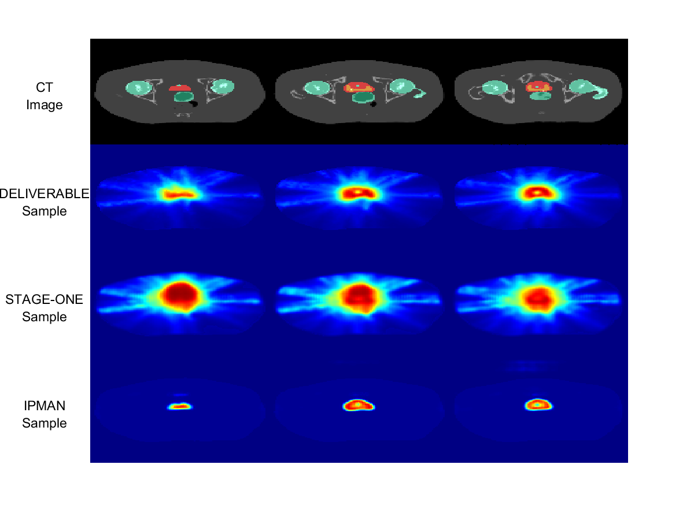

# Interior Point Methods with Adversarial Networks

Code for the paper "Interior Point Methods with Adversarial Networks", submitted to NIPS 2018.

We present a new methodology, called IPMAN, that combines interior point methods and generative adveresarial networks to solve constrained optimization problems with feasible sets that are non-convex or not explicitly defined. Our methodology produces epsilon-optimal solutions and demonstrates that, when there are multiple global optima, it learns a distribution over the optimal set.

This code contains the implementations for for the numerical experiments in Sections 4.1 and 4.2 of the paper. In the synthetic folder, we have the code for several toy examples. In the gancer folder, we apply our methodology on the intensity modulated radiation therapy (IMRT) treatment planning problem.

.


## Prerequisites
- Linux or OS X
- Python 3
- CPU or NVIDIA GPU + CUDA CuDNN

## Getting started
### Installation
- Setup virtual environment
- Install PyTorch and depedencies from http://pytorch.org
- Install Torch vision from the source
```bash
git clone https://github.com/pytorch/vision
cd vision
python setup.py install
```
- Add checkpoints and plots directories inside synthetic folder
- Add checkpoints, datasets, and results directories inside gancer folder
- Install python libraries [visdom](https://github.com/facebookresearch/visdom) and [dominate](https://github.com/Knio/dominate)


## Running the code
### Synthetic

You can modify model parameters inside `options.py`. The synthetic code is set up in four stages:
- predict: stage 1 of IPMAN, generates the feasible set distribution and the barrier function, then saves the model in checkpoints directory.
- plot:  to test stage 1, loads the model and plots the generator and discriminator distributions.
- optimize: stage 2 of IPMAN, solves one of the four optimization problems in the paper (linear, bilinear, quadratic, rosenbrock).
- compare: generates plots showing how the constrained and unconstrained problems are solved (used to compare rosenbrock).

To run the examples, first run predict, then optimize:
```
python synthetic_examples.py --stage predict
python synthetic_examples.py --stage optimize --opt linear
```


### IMRT / GANCER

We will provide the data set at a later date.


## Acknowledgements

The codebase in the the IMRT example is derived from a [previous architecture](https://github.com/rafidrm/gancer), which itself borrows from the CycleGAN PyTorch implementation of [junyanz](https://github.com/junyanz/pytorch-CycleGAN-and-pix2pix).


